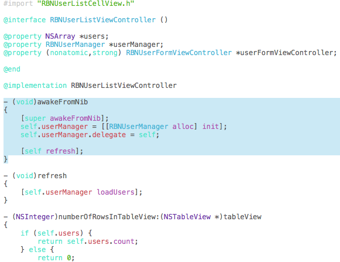

# xcode-ios7-colors

Xcode syntax highlighting iOS7 color scheme.

## Install

You can install this theme using [Alcatraz XCode Package Manager](http://alcatraz.io/) by searching for `iOS 7` or executing the following script from your terminal:

    curl https://raw.github.com/dpree/xcode-ios7-colors/master/iOS%207.dvtcolortheme > "$HOME/Library/Developer/Xcode/UserData/FontAndColorThemes/iOS 7.dvtcolortheme"

## Local Development

### Install

    ./install.sh

### Backup

    ./install.sh backup

# License

See [LICENSE](LICENSE.txt).
